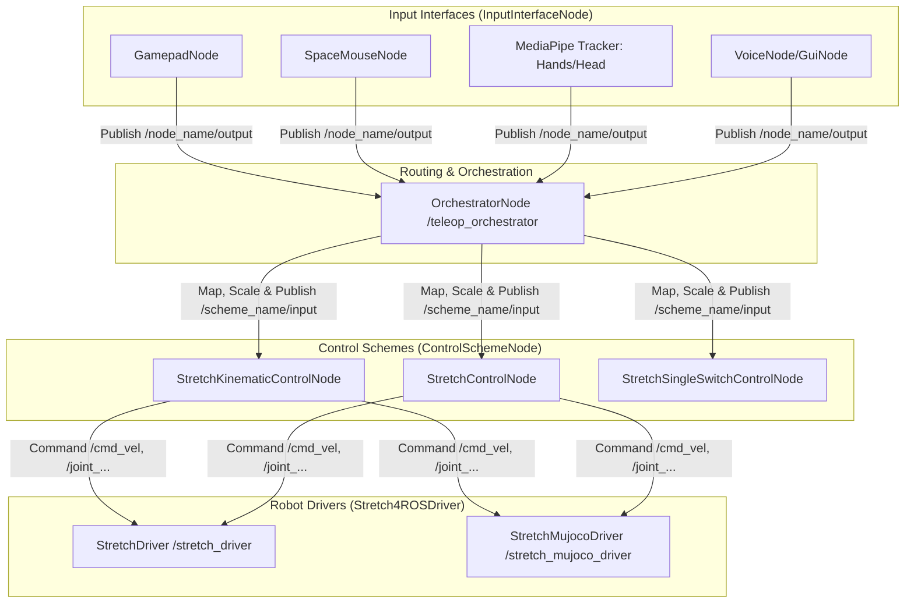

# Agent Developer Guide: `stretch4_multi_teleop`

Welcome! This guide is designed for both human developers and agentic AI systems working with the `stretch4_multi_teleop` package. It details the system architecture, explains how signals are routed, and provides step-by-step code recipes to extend the teleoperation pipeline with new inputs and control schemes.

---

## 1. System Architecture

The package implements a highly modular, decoupled **three-tier teleoperation architecture** that routes arbitrary user inputs to any compatible control scheme.



### The Three Tiers:
1.  **Input Interfaces** (`InputInterfaceNode` subclasses): Capture signals from hardware or tracking software (e.g., gamepads, cameras, mic) and publish standardized `sensor_msgs/msg/Joy` messages.
2.  **The Orchestrator** (`OrchestratorNode`): Acts as a centralized signal-routing board. It dynamically discovers input interfaces and control schemes, manages coordinate transformations/scaling, and forwards processed commands.
3.  **Control Schemes** (`ControlSchemeNode` subclasses): Receive the routed inputs and solve kinematics (e.g., IK using Pinocchio) or perform direct mapping to publish actual movement commands to the robot driver.

---

## 2. Core Base Classes

All inputs and control schemes must subclass the abstract classes defined in `multi_teleop/base.py`.

### A. `InputInterfaceNode`
This class manages the local state of an input device (axes and buttons) and publishes standard messages.

*   **Key Fields**:
    *   `_axes` & `_buttons`: List of string names defining what each index represents.
    *   `_last_axes` & `_last_buttons`: Tracks the current state of the device.
*   **Key Methods**:
    *   `publish_input(axis_values: list, button_values: list)`: Updates internal state and publishes a `sensor_msgs/msg/Joy` message to `/{node_name}/output`.

### B. `ControlSchemeNode`
This class represents a consumer of teleoperation commands (e.g., kinematic, single-switch, or joint-by-joint control).

*   **Activation Services**: Registers `/{node_name}/activate` and `/{node_name}/deactivate` (`std_srvs/srv/Trigger`) services.
*   **Publish-Interception**: Automatically wraps and overrides `create_publisher` so that **all publishers in child classes are silenced when the scheme is inactive**. This prevents conflicting background commands.
*   **Key Abstract Method**:
    *   `handle_joy(axes: list, buttons: list)`: Must be implemented by the child class to process the incoming mapped commands.

---

## 3. The Teleop Orchestrator (`teleop_orchestrator.py`)

The orchestrator (`OrchestratorNode`) runs a dynamic control loop and features an optional Adwaita/GTK UI (`OrchestratorUI`).

### A. Dynamic Discovery
Every 2 seconds (`discover_environment`), the orchestrator:
1.  Scans active ROS 2 topics for publishers of `sensor_msgs/msg/Joy`.
2.  Queries discovered publisher nodes' parameters to fetch their `axis_names` and `button_names`.
3.  Subscribes to those topics dynamically.
4.  Identifies control scheme nodes (subscribers of `Joy` topics) and retrieves their supported input schemes.

### B. Mappings, Sensitivity, and Inversion
The orchestrator maps input sources to control scheme fields on an output-by-output basis. It supports:
*   **Inversion**: Toggling sign multiplication (`-1.0`) for individual axes.
*   **Sensitivity Scaling**: Applying gain multipliers on the raw inputs.
*   **Multi-Mapping Muxing**: Schemes can define multiple "mapping pages" (e.g. page 0 for base navigation, page 1 for arm manipulation). Pressing a configured cycle-button swaps active mappings on the fly.

### C. Virtual Signal Constructions
For advanced mappings, the orchestrator allows constructing virtual signals:
*   `AxisToButton`: Fires a button press when an axis crosses a threshold.
*   `TwoButtonsToAxis`: Combines two discrete buttons (e.g., Up/Down) into a single analog axis (range `-1.0` to `1.0`).
*   `DeadbandAxis`: Ignores small analog drifts around the origin.
*   `LogicalButton`: Creates Boolean logic gates (AND, OR, NOT) on buttons.
*   `AverageAxis` / `InvertAxis` / `SquareAxis` / `SqrtAxis`: Mathematic filters.

---

## 4. Extension Recipes

### Recipe A: Creating a New Input Interface
To register a new input device (for example, a custom tracking camera or device), inherit from `InputInterfaceNode`.

```python
import rclpy
from multi_teleop.base import InputInterfaceNode

class CustomInputNode(InputInterfaceNode):
    def __init__(self):
        # Declare axis and button identifiers
        axes = ["lateral_tilt", "forward_lean"]
        buttons = ["trigger_click", "mode_switch"]
        
        super().__init__("custom_input_node", axes, buttons)
        
        # Periodic loop to query hardware/sensors
        self.create_timer(0.05, self.read_and_publish) # 20 Hz

    def read_and_publish(self):
        # Replace with actual hardware/API reader code
        tilt = 0.5   # Dummy analog reading [-1.0, 1.0]
        lean = -0.1  # Dummy analog reading [-1.0, 1.0]
        click = 0    # Discrete button state [0 or 1]
        mode = 1     # Discrete button state [0 or 1]
        
        # Publish standardized Joy packet to /custom_input_node/output
        self.publish_input([tilt, lean], [click, mode])

def main(args=None):
    rclpy.init(args=args)
    node = CustomInputNode()
    rclpy.spin(node)
    node.destroy_node()
    rclpy.shutdown()
```

### Recipe B: Creating a New Control Scheme
To command the robot with custom logic, create a subclass of `ControlSchemeNode`.

```python
import rclpy
from multi_teleop.base import ControlSchemeNode
from sensor_msgs.msg import JointState
from geometry_msgs.msg import Twist

class CustomControlNode(ControlSchemeNode):
    def __init__(self):
        # Define the axes and buttons this control scheme expects
        self.axis_names = ["Drive_Linear", "Drive_Angular", "Arm_Extend"]
        self.button_names = ["Stop_All"]
        
        super().__init__("custom_control_scheme", self.axis_names, self.button_names)
        
        # Setup publishers to actual robot driver
        # (These are automatically silenced/ignored when inactive!)
        self.base_pub = self.create_publisher(Twist, "/cmd_vel", 10)
        self.joint_pub = self.create_publisher(JointState, "/joint_position_cmd", 10)

    def handle_joy(self, axes: list, buttons: list):
        # 1. Check safety buttons
        if buttons[0] == 1: # "Stop_All" pressed
            self.get_logger().warn("Emergency stop requested via teleop!")
            self.base_pub.publish(Twist()) # Zero base velocities
            return

        # 2. Base Navigation
        twist = Twist()
        twist.linear.x = axes[0] * 0.4  # Drive_Linear (scaled)
        twist.angular.z = axes[1] * 0.5 # Drive_Angular (scaled)
        self.base_pub.publish(twist)

        # 3. Arm Control
        js = JointState()
        js.name = ["arm_joint"]
        js.position = [axes[2] * 0.5] # Arm_Extend
        self.joint_pub.publish(js)

def main(args=None):
    rclpy.init(args=args)
    node = CustomControlNode()
    rclpy.spin(node)
    node.destroy_node()
    rclpy.shutdown()
```

---

## 5. Launch and Setup

### Dynamic Parameter Inspection
You can check discovered configurations and active parameter configurations for any active teleop scheme or input via the command line:

```bash
# List dynamic parameters for the orchestrator
ros2 param list /teleop_orchestrator

# See the active control scheme parameters
ros2 param get /teleop_orchestrator selected_scheme
```

### Complete Launch Sequence (Simulation)
1.  **Start Zenoh (Middleware)**:
    ```bash
    ros2 run rmw_zenoh_cpp rmw_zenohd
    ```
2.  **Launch Driver (MuJoCo Sim)**:
    ```bash
    export MUJOCO_GL=egl
    ros2 launch stretch_simulation stretch_mujoco_driver.launch.py mode:=position
    ```
3.  **Launch Control Schemes**:
    ```bash
    ros2 launch control_schemes test_control.launch.py
    ```
4.  **Launch Orchestrator GUI**:
    ```bash
    ros2 run multi_teleop teleop_orchestrator
    ```
5.  **Enable Your Preferred Scheme**:
    Set the mapping via the GUI or service client:
    ```bash
    ros2 service call /stretch_kinematic_control/activate std_srvs/srv/Trigger
    ```
